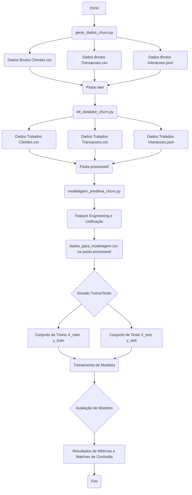

# Projeto de Análise Preditiva de Churn de Clientes

Este repositório contém um projeto de análise preditiva focado na identificação de clientes propensos ao *churn* (cancelamento de serviços). O projeto abrange desde a simulação de dados brutos, passando pelo processo de ETL (Extração, Transformação e Carga), até a modelagem preditiva utilizando diferentes algoritmos de Machine Learning.

## Estrutura do Repositório

A estrutura de pastas e arquivos está organizada para refletir um pipeline de dados e modelagem:

```bash
├── data_lake_churn/
│   ├── raw/
│   │   ├── clientes.csv
│   │   ├── transacoes.csv
│   │   ├── interacoes.json
│   ├── processed/
│   │   ├── clientes_tratado.csv
│   │   ├── transacoes_tratado.csv
│   │   ├── interacoes_tratado.json
│   │   └── dados_para_modelagem.csv
│   ├── gerar_dados_churn.py
│   ├── etl_datalake_churn.py
│   └── modelagem_preditiva_churn.py
└── README.md
```

-   **`data_lake_churn/raw/`**: Contém os dados brutos simulados, representando a fonte inicial de dados.
-   **`data_lake_churn/processed/`**: Armazena os dados após passarem pelo processo de ETL, limpos, transformados e prontos para a análise ou modelagem. Inclui também o dataset final consolidado (`dados_para_modelagem.csv`) usado nos modelos.
-   **`gerar_dados_churn.py`**: Script responsável por simular e gerar os dados brutos iniciais.
-   **`etl_datalake_churn.py`**: Script que implementa o processo de ETL, extraindo dados do diretório `raw/`, aplicando transformações e carregando os dados tratados no diretório `processed/`.
-   **`modelagem_preditiva_churn.py`**: Script central para a fase de modelagem, que carrega os dados tratados, realiza engenharia de *features*, divide os dados para treinamento e teste, treina e avalia os modelos preditivos.

## Pipeline de Dados e Modelagem Preditiva

O projeto segue um pipeline de dados claro e modular, desde a geração de dados brutos até a avaliação dos modelos preditivos.

---

### 1. Geração de Dados Brutos

O primeiro passo é a criação de dados sintéticos que simulam o comportamento de clientes, suas transações e interações.

-   **Script:** `data_lake_churn/gerar_dados_churn.py`
-   **Função:** `gerar_dados_clientes()`, `gerar_dados_transacoes()`, `gerar_dados_interacoes()`
-   **Output:** `clientes.csv`, `transacoes.csv` e `interacoes.json` em `data_lake_churn/raw/`.

---

### 2. Processo de ETL (Extração, Transformação e Carga)

Esta etapa é crucial para limpar, organizar e padronizar os dados, tornando-os adequados para a análise e modelagem.

-   **Script:** `data_lake_churn/etl_datalake_churn.py`
-   **Funções:**
    -   `extract_data()`: Lê os dados dos arquivos brutos.
    -   `transform_clientes()`, `transform_transacoes()`, `transform_interacoes()`: Realizam limpeza, padronização e conversão de tipos de dados.
    -   `load_data()`: Salva os dados transformados no diretório `processed/`.
-   **Output:** `clientes_tratado.csv`, `transacoes_tratado.csv` e `interacoes_tratado.json` em `data_lake_churn/processed/`.

---

### 3. Modelagem Preditiva

A fase de modelagem envolve a preparação final dos dados, a escolha, treinamento e avaliação de modelos de Machine Learning para prever o *churn*.

-   **Script:** `data_lake_churn/modelagem_preditiva_churn.py`
-   **Funções:**
    -   `load_processed_data()`: Carrega os dados tratados do diretório `processed/`.
    -   `prepare_data_for_modeling()`:
        -   Realiza **Feature Engineering**: Cria novas características a partir dos dados existentes (ex: total de transações, número de interações negativas, última interação do cliente).
        -   **Unifica os Dados**: Mescla os *DataFrames* de clientes, transações e interações em um único *dataset*.
        -   **Codificação de Variáveis Categóricas**: Converte variáveis textuais (ex: 'plano', 'tipo_interacao') em um formato numérico através de One-Hot Encoding.
        -   **Criação do Target (`churn`) Sintético**: Para fins de demonstração, a coluna `churn` é definida com base em regras (ex: status 'inativo' ou alta proporção de interações negativas).
    -   `train_and_evaluate_models()`:
        -   **Divisão dos Dados**: Utiliza `train_test_split` para separar o *dataset* em conjuntos de treinamento (80%) e teste (20%), garantindo que os modelos sejam avaliados em dados que não viram durante o treinamento. A estratificação (`stratify=y`) é usada para manter a proporção da classe `churn` em ambos os conjuntos.
        -   **Treinamento de Modelos**: Instancia e treina dois modelos preditivos: **Random Forest Classifier** e **Logistic Regression**.
        -   **Avaliação de Modelos**: Calcula e exibe métricas de desempenho para cada modelo.

---

# Projeto de Análise Preditiva de Churn de Clientes

Este repositório contém um projeto de análise preditiva focado na identificação de clientes propensos ao **churn** (cancelamento de serviços). O projeto abrange desde a simulação de dados brutos, passando pelo processo de **ETL (Extração, Transformação e Carga)**, até a **modelagem preditiva** utilizando diferentes algoritmos de Machine Learning.

-----

### 1\. Resgate do Problema e Solução Proposta

No cenário atual de negócios, a **retenção de clientes** é um fator crítico para a sustentabilidade e crescimento de qualquer empresa. O fenômeno do **churn** (abandono de clientes) representa uma perda significativa de receita e recursos, tornando sua previsão e mitigação uma prioridade.

**Problema:** Identificar clientes com alta probabilidade de churn antes que eles de fato cancelem seus serviços.

**Solução Proposta:** Desenvolver um sistema de **análise preditiva de churn** baseado em dados, que permita à empresa antecipar o comportamento de seus clientes e implementar estratégias proativas de retenção. Para isso, construímos um **Data Lake** para centralizar os dados brutos, um processo de **ETL (Extract, Transform, Load)** para prepará-los e, por fim, modelos de **Machine Learning** para realizar as previsões.

-----

### 2\. Estrutura do Data Lake e Dados Transformados

Nosso Data Lake foi projetado para armazenar dados brutos e processados em um formato flexível, facilitando a ingestão de diversas fontes de dados. A estrutura de diretórios é simples e eficiente:

  * **`raw/`**: Contém os dados brutos, exatamente como foram extraídos de suas fontes originais (simuladas, neste caso).
  * **`processed/`**: Armazena os dados após passarem pelo processo de ETL, prontos para a análise e modelagem.

**Estrutura de Pastas:**

```
data_lake_churn/
├── processed/
│   ├── clientes_tratado.csv
│   ├── dados_para_modelagem.csv
│   ├── interacoes_tratado.json
│   └── transacoes_tratado.csv
└── raw/
    ├── clientes_bruto.csv
    ├── interacoes_bruto.json
    └── transacoes_bruto.csv
```

#### Dados Transformados/Preparados (`processed/`)

Os dados transformados são o resultado do nosso pipeline ETL e são fundamentais para a qualidade da modelagem. Eles foram unificados e enriquecidos com novas características (**feature engineering**) para melhor representar o comportamento do cliente.

Os arquivos resultantes na pasta `processed` são:

  * **`clientes_tratado.csv`**: Clientes com a data de adesão padronizada e as colunas categóricas (`status`, `plano`) convertidas para o tipo `category` do Pandas, otimizando o uso de memória.
  * **`transacoes_tratado.csv`**: Transações com a data de transação padronizada.
  * **`interacoes_tratado.json`**: Interações com a data formatada para string (`%Y-%m-%d %H:%M:%S`), e as colunas categóricas (`tipo_interacao`, `canal`, `sentimento`) convertidas para minúsculas, garantindo consistência.
  * **`dados_para_modelagem.csv`**: Este é o dataset final, unificado e preparado especificamente para os modelos de Machine Learning. Ele inclui:
      * Informações de clientes.
      * **Agregações de transações**: `total_valor_transacoes` (soma dos valores) e `num_transacoes` (contagem de transações).
      * **Agregações de interações**: `num_interacoes_negativas` (contagem de interações com sentimento negativo).
      * **Última interação**: `tipo_ultima_interacao`, `sentimento_ultima_interacao`, `canal_ultima_interacao`.
      * **Codificação One-Hot Encoding**: Aplicada a colunas categóricas como `plano`, `tipo_ultima_interacao`, `sentimento_ultima_interacao`, `canal_ultima_interacao`.
      * **Coluna `churn` sintética**: Criada com base em regras predefinidas (`status` 'inativo' ou `num_interacoes_negativas` \> 2 e plano não Premium), servindo como o nosso alvo para a predição.

A amostra do `dados_para_modelagem.csv` exibida no terminal mostra a estrutura final:

```
   id_cliente  tempo_assinatura  ...  canal_ultima_interacao_telefone  churn
0           1                 5  ...                            False      0
1           2                12  ...                            False      0
2           3                 6  ...                             True      0
3           4                17  ...                            False      0
4           5                10  ...                            False      1
```

O dataset final contém **500 linhas e 21 colunas**, com uma distribuição balanceada (258 clientes com churn e 242 sem churn), ideal para o treinamento dos modelos.

-----

### 3\. Pipeline de Dados para Modelagem Preditiva

O pipeline completo abrange as etapas de geração de dados, ETL e preparação para modelagem. Os scripts Python orquestram este fluxo:

  * **`gerar_dados_churn.py`**: Simula a geração de dados brutos de clientes, transações e interações, salvando-os na pasta `raw/`.
      * **Funções Principais:** `gerar_dados_clientes()`, `gerar_dados_transacoes()`, `gerar_dados_interacoes()`.
  * **`etl_datalake_churn.py`**: Realiza o processo de ETL. Extrai os dados de `raw/`, aplica transformações (tratamento de datas, tipagem, normalização) e carrega os resultados na pasta `processed/`.
      * **Funções Principais:** `extract_clientes()`, `extract_transacoes()`, `extract_interacoes()`, `transform_clientes()`, `transform_transacoes()`, `transform_interacoes()`, `load_clientes()`, `load_transacoes()`, `load_interacoes()`.
  * **`modelagem_preditiva_churn.py`**: Carrega os dados tratados de `processed/`, realiza o *Feature Engineering* adicional, unifica os datasets, define a coluna alvo (`churn`), e então treina e avalia os modelos de Machine Learning.
      * **Funções Principais:** `load_processed_data()`, `prepare_data_for_modeling()`, `train_and_evaluate_models()`.
      * **Pipeline de Treinamento/Teste:** Os dados são divididos em 80% para treino (`X_train`, `y_train`) e 20% para teste (`X_test`, `y_test`) usando `train_test_split`, com estratificação para manter a proporção de churn.

#### Diagrama de Fluxo de Dados (Mermaid)



-----

### 4\. Modelagem Preditiva e Análise de Resultados

Para a tarefa de previsão de churn, foram selecionadas duas técnicas de modelagem preditiva amplamente utilizadas: **Random Forest Classifier** e **Logistic Regression**.

#### Motivação da Escolha dos Modelos:

  * **Random Forest Classifier:** É um algoritmo de *ensemble* que constrói múltiplas árvores de decisão durante o treinamento. Para prever a classe de uma nova amostra, ele coleta as previsões de todas as árvores e seleciona a classe que mais aparece (voto majoritário). É conhecido por sua **robustez a *overfitting***, lida bem com **dados não-lineares** e com a **importância de *features***, sendo uma excelente opção para problemas de classificação complexos. Geralmente, oferece alta acurácia.
  * **Logistic Regression:** Apesar do nome "regressão", é um algoritmo fundamental e amplamente utilizado para problemas de classificação binária. Ele modela a probabilidade de um resultado (aqui, a probabilidade de churn) usando uma função logística (sigmoide). Se a probabilidade calculada for maior que um certo limite (geralmente 0.5), a classe é prevista como positiva (1), caso contrário, negativa (0). É um modelo **linear, simples, rápido de treinar** e oferece **boa interpretabilidade**, servindo como uma excelente **linha de base (*baseline*)** para comparação com modelos mais complexos.

#### Métricas de Análise Preditiva Utilizadas:

Para avaliar o desempenho dos modelos, utilizamos as seguintes métricas, essenciais em problemas de classificação, especialmente em cenários de churn onde a identificação correta de clientes que vão sair é crucial:

  * **Acurácia (Accuracy):** Proporção de predições corretas (verdadeiros positivos + verdadeiros negativos) sobre o total de predições.
      * **Interpretação:** Medida geral de quão bem o modelo acerta. Pode ser enganosa em datasets desbalanceados.
  * **Precisão (Precision):** Proporção de verdadeiros positivos sobre o total de predições positivas (verdadeiros positivos + falsos positivos).
      * **Interpretação:** Quão confiável é o modelo quando ele prevê que um cliente terá churn. Alta precisão significa menos "falsos alarmes" (prever churn para quem não terá).
  * **Recall (Sensibilidade ou Cobertura):** Proporção de verdadeiros positivos sobre o total de casos positivos reais (verdadeiros positivos + falsos negativos).
      * **Interpretação:** Quão bem o modelo identifica todos os clientes que *realmente* terão churn. Alto recall significa que o modelo "captura" a maioria dos clientes que abandonarão o serviço (minimiza perdas reais).
  * **F1-Score:** Média harmônica da Precisão e do Recall.
      * **Interpretação:** Uma métrica que busca um equilíbrio entre Precisão e Recall. É útil quando se busca um balanço entre evitar falsos positivos e falsos negativos.
  * **Matriz de Confusão:** Tabela que mostra o número de verdadeiros positivos (TP), verdadeiros negativos (TN), falsos positivos (FP) e falsos negativos (FN).
      * **TN (True Negatives):** Clientes que não terão churn e o modelo previu corretamente que não terão.
      * **FP (False Positives):** Clientes que não terão churn, mas o modelo previu incorretamente que terão (falsos alarmes).
      * **FN (False Negatives):** Clientes que terão churn, mas o modelo previu incorretamente que não terão (clientes perdidos que o modelo não identificou).
      * **TP (True Positives):** Clientes que terão churn e o modelo previu corretamente que terão.

#### Resultados dos Modelos:

| Métrica            | Random Forest Classifier | Logistic Regression |
| :----------------- | :----------------------- | :------------------ |
| **Acurácia** | 0.4500                   | 0.5900              |
| **Precisão** | 0.4717                   | 0.6000              |
| **Recall** | 0.4808                   | 0.6346              |
| **F1-Score** | 0.4762                   | 0.6168              |
| **Matriz de Confusão** (Exemplo para 100 amostras de teste) | `[[20 28]`\<br\>`  [27 25]] ` | `[[26 22]`\<br\>`  [19 33]] ` |

#### Análise do Resultado e Interpretações:

Os resultados indicam que a **Regressão Logística** superou o **Random Forest Classifier** em todas as métricas avaliadas neste cenário sintético.

**Random Forest Classifier (Desempenho Inferior):**

  * **Acurácia de 0.45:** Muito próxima de um chute aleatório (50%), o que é um resultado fraco.
  * **Matriz de Confusão:**
      * **TN (20):** Acertou 20 clientes que não teriam churn.
      * **FP (28):** Errou 28 clientes, prevendo churn quando não ocorreria.
      * **FN (27):** Errou 27 clientes, prevendo não-churn quando ocorreria (perda real).
      * **TP (25):** Acertou 25 clientes que teriam churn.
  * O baixo desempenho pode indicar que, para a complexidade gerada pelos dados sintéticos, o Random Forest talvez esteja *subajustado* (underfitting) ou que as relações não-lineares que ele busca não são tão fortes quanto esperado com as *features* atuais. Também pode ser um indício de que o modelo está sofrendo para encontrar padrões claros na forma como o churn foi simulado.

**Logistic Regression (Desempenho Superior):**

  * **Acurácia de 0.59:** Embora ainda não seja excelente, é significativamente melhor que a Random Forest, mostrando que o modelo conseguiu aprender padrões.
  * **Matriz de Confusão:**
      * **TN (26):** Acertou 26 clientes que não teriam churn.
      * **FP (22):** Errou 22 clientes, prevendo churn quando não ocorreria (menor que RF).
      * **FN (19):** Errou 19 clientes, prevendo não-churn quando ocorreria (menor que RF, o que é bom para evitar perdas).
      * **TP (33):** Acertou 33 clientes que teriam churn (maior que RF).
  * A **Regressão Logística** demonstrou maior capacidade de identificar clientes com churn (**Recall de 0.6346**) e também teve uma Precisão razoável (**0.6000**), o que é importante para que as ações de retenção sejam direcionadas aos clientes corretos.

**Suposições e Próximos Passos (Visão do Analista de Dados):**

1.  **Natureza dos Dados Sintéticos:** A principal suposição é que a forma como o churn foi gerado sinteticamente (baseado em `status` e `num_interacoes_negativas` + `plano`) pode favorecer a simplicidade de um modelo linear como a Regressão Logística. Em dados reais, a relação entre features e churn é geralmente mais complexa, o que poderia beneficiar modelos como Random Forest.
2.  **Qualidade das Features:** O desempenho ainda moderado (acurácia abaixo de 0.70) sugere que podemos precisar de **mais ou melhores *features***. Em um cenário real, poderíamos explorar:
      * **Engajamento com o produto/serviço:** frequência de login, uso de funcionalidades específicas.
      * **Histórico de pagamentos:** atrasos, mudanças de plano.
      * **Dados demográficos:** idade, localização, renda (se disponíveis).
      * **Análise temporal:** tempo desde a última interação, tendência de uso.
3.  **Ajuste de Hiperparâmetros:** Os modelos foram usados com configurações padrão. Um processo de **otimização de hiperparâmetros** (usando Grid Search ou Random Search) poderia melhorar o desempenho de ambos os modelos, especialmente do Random Forest.
4.  **Balanceamento de Classes:** Embora a proporção de churn no nosso dataset sintético seja razoavelmente balanceada, em um cenário real, o churn costuma ser um evento raro (classe minoritária). Técnicas como SMOTE, oversampling ou undersampling seriam essenciais para lidar com esse desbalanceamento e evitar que o modelo seja viesado para a classe majoritária.
5.  **Métricas de Negócio:** Além das métricas técnicas, é crucial definir **métricas de negócio** com a equipe. Por exemplo, qual o custo de um falso positivo (ação de retenção desnecessária) versus o custo de um falso negativo (perda de cliente)? Isso ajudaria a ajustar o modelo para priorizar Precisão ou Recall conforme a estratégia da empresa.

Em suma, o pipeline está funcional e os modelos foram implementados com sucesso. Os resultados atuais servem como um bom ponto de partida, mas um projeto real exigiria mais iterações de *feature engineering* e otimização para atingir níveis de desempenho adequados para tomada de decisão.

-----

### Como Rodar o Projeto

Para executar o pipeline completo e reproduzir os resultados:

1.  **Clone o Repositório:**
    ```bash
    git clone <URL_DO_SEU_REPOSITORIO>
    cd analise-preditiva
    ```
2.  **Crie e Ative o Ambiente Virtual (se ainda não fez):**
    ```bash
    python -m venv .venv
    # No Windows:
    .\.venv\Scripts\activate
    # No macOS/Linux:
    source ./.venv/bin/activate
    ```
3.  **Instale as Dependências:**
    ```bash
    pip install pandas scikit-learn numpy faker
    ```
4.  **Execute os Scripts em Ordem:**
    ```bash
    python data_lake_churn/gerar_dados_churn.py
    python data_lake_churn/etl_datalake_churn.py
    python data_lake_churn/modelagem_preditiva_churn.py
    ```
    Os resultados da modelagem serão exibidos no console e o dataset final para modelagem será salvo em `data_lake_churn/processed/dados_para_modelagem.csv`.