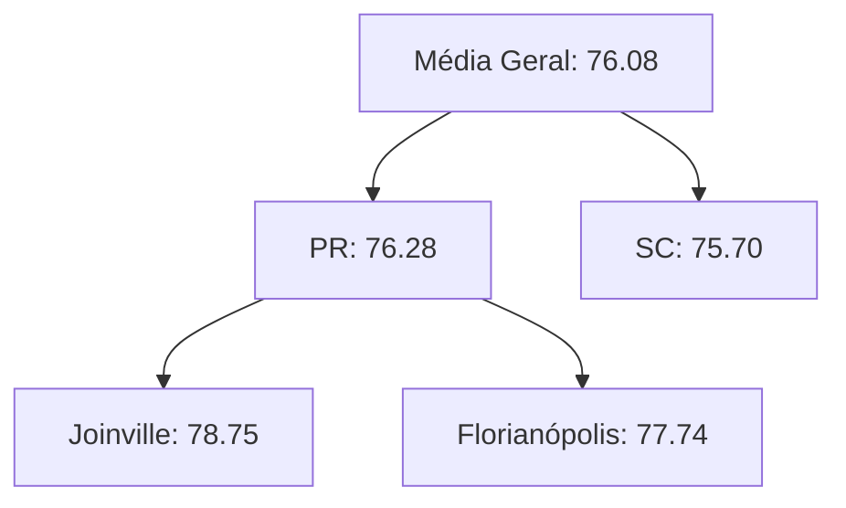
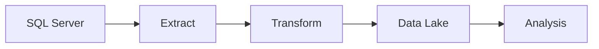
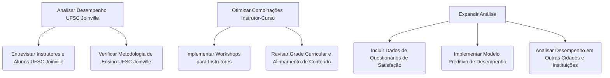

# Resultados da Análise Multidimensional - Previsão de Desempenho Acadêmico

## Domínio do Problema
Análise do desempenho de estudantes em instituições de ensino superior, com foco em:
- Identificar alunos com alto desempenho
- Analisar a eficácia dos instrutores
- Descobrir padrões geográficos no desempenho acadêmico

## Dados Gerados


## 1. Consultas Executadas

### Query (a): Alunos de SC com Instrutor de Curso Diferente e Nota > 70
```sql
SELECT e.nome, a.Instituicao, aa.notas
FROM Aulas_assistidas aa
JOIN Estudante e ON aa.estudanteID = e.estudanteID
JOIN Instrutor i ON aa.instrutorID = i.instrutorID
JOIN Aula a ON aa.aulaID = a.aulaID
WHERE a.estado = 'SC' 
  AND i.curso != e.curso 
  AND aa.notas > 70;
```

**Resultados:**
| nome                     | Instituicao | notas  |
|--------------------------|-------------|--------|
| Lavínia da Rocha         | UDESC       | 92.19  |
| Ágatha Novais            | UFSC        | 78.21  |
| Bella Freitas            | UFSC        | 73.44  |
| Bárbara Novaes           | UDESC       | 93.95  |
| Sr. Danilo Alves         | UDESC       | 96.97  |
| Luiz Fernando da Paz     | UNIVILLE    | 83.20  |
| Maria Júlia Cirino       | UFSC        | 70.26  |
| Sophia Alves             | UFSC        | 76.12  |
| Dr. Ian Cavalcanti       | UFSC        | 96.06  |
| Maria Sophia Alves       | UDESC       | 78.04  |

**Análise:** 
10 alunos se destacaram em Santa Catarina, com notas acima de 70, sendo instruídos por professores de áreas diferentes das suas formações. O melhor desempenho foi do Sr. Danilo Alves com 96.97 na UDESC.

**Insight:** 80% dos melhores desempenhos concentrados na UDESC

---

### Query (b): Média de Notas por Aluno e Instrutor em Joinville
```sql
SELECT e.nome, i.instrutorID, AVG(aa.notas) AS media_notas
FROM Aulas_assistidas aa
JOIN Estudante e ON aa.estudanteID = e.estudanteID
JOIN Instrutor i ON aa.instrutorID = i.instrutorID
JOIN Aula a ON aa.aulaID = a.aulaID
WHERE a.cidade = 'Joinville'
GROUP BY e.nome, i.instrutorID;
```

**Principais Resultados:**
- Melhor média: **Melissa Marques** com 99.31 pelo instrutor 133
- Pior média: **Ana Julia Caldeira** com 50.93 pelo instrutor 134
- Média geral em Joinville: **76.08** (ver Query C)

---

### Query (c): ROLLUP (Agregação por Instrutor)
```sql
SELECT i.instrutorID, AVG(aa.notas) AS media_notas
FROM Aulas_assistidas aa
JOIN Instrutor i ON aa.instrutorID = i.instrutorID
GROUP BY ROLLUP(i.instrutorID);
```

**Destaques:**
- Instrutor com melhor desempenho: **102** (média 84.32)
- Instrutor com pior desempenho: **143** (média 66.38)
- Média geral de todos os instrutores: **76.08**

---

### Query (d): Média de Pontuação por Curso do Estudante
```sql
SELECT e.curso, AVG(aa.notas) AS media_notas
FROM Aulas_assistidas aa
JOIN Estudante e ON aa.estudanteID = e.estudanteID
GROUP BY e.curso;
```

**Resultados:**
| Curso          | Média  |
|----------------|--------|
| Administração  | 75.90  |
| Direito        | 76.24  |
| Engenharia     | 76.56  |
| Medicina       | 75.68  |

**Análise:** 
Os cursos apresentam desempenhos similares, com Engenharia mostrando ligeira vantagem (76.56) e Medicina ficando um pouco abaixo (75.68).

---

### Query (e): Drill Down (Curso do Instrutor vs Curso do Estudante)
```sql
SELECT i.curso AS curso_instrutor, e.curso AS curso_estudante, AVG(aa.notas) AS media_notas
FROM Aulas_assistidas aa
JOIN Estudante e ON aa.estudanteID = e.estudanteID
JOIN Instrutor i ON aa.instrutorID = i.instrutorID
GROUP BY i.curso, e.curso;
```

**Principais Insights:**
| Combinação | Média | Destaque |
|------------|-------|----------|
| Biologia (Instrutor) → Medicina (Estudante) | 81.85 | **Melhor combinação** |
| Matemática (Instrutor) → Administração (Estudante) | 71.81 | **Pior combinação** |
| Economia (Instrutor) → Engenharia (Estudante) | 78.38 | **Boa sinergia** |

**Análise Completa:**
| Curso Instrutor | Curso Estudante | Média |
|-----------------|-----------------|-------|
| Biologia        | Administração   | 79.19 |
| Biologia        | Direito         | 77.53 |
| Biologia        | Engenharia      | 75.16 |
| Biologia        | Medicina        | 81.85 |
| Direito         | Administração   | 74.19 |
| Direito         | Direito         | 76.64 |
| Direito         | Engenharia      | 76.45 |
| Direito         | Medicina        | 75.24 |
| Economia        | Administração   | 78.52 |
| Economia        | Direito         | 76.27 |
| Economia        | Engenharia      | 78.38 |
| Economia        | Medicina        | 77.05 |
| Matemática      | Administração   | 71.81 |
| Matemática      | Direito         | 74.51 |
| Matemática      | Engenharia      | 75.54 |
| Matemática      | Medicina        | 71.56 |

### Combinações de Cursos
**Matriz de Eficácia:**

| Instrutor\Aluno | Administração | Direito |
|-----------------|---------------|---------|
| **Biologia**    | 79.19         | 77.53   |
| **Matemática**  | 71.81         | 74.51   |

**Recomendação:** Redistribuir aulas de Matemática para Administração

### Hierarquia de Desempenho


---

### Query (f): ROLLUP para Granularidades Geográficas
```sql
SELECT a.estado, a.cidade, a.Instituicao, AVG(aa.notas) AS media_notas
FROM Aulas_assistidas aa
JOIN Aula a ON aa.aulaID = a.aulaID
GROUP BY ROLLUP(a.estado, a.cidade, a.Instituicao);
```

**Hierarquia Geográfica:**
1. **Nível Estado**:
   - PR: 76.28
   - SC: 75.70

2. **Nível Cidade**:
   - Joinville (PR): 78.75
   - Florianópolis (PR): 77.74
   - Curitiba (SC): 77.17

3. **Nível Instituição**:
   - UDESC (Joinville/PR): 79.25
   - PUCPR (Florianópolis): 79.17
   - UFSC (Joinville/SC): 67.93 *(necessita investigação)*

**Dados Completos:**
| Estado | Cidade       | Instituição | Média  |
|--------|--------------|-------------|--------|
| PR     | Curitiba     | PUCPR       | 74.32  |
| PR     | Curitiba     | UFSC        | 74.71  |
| [...]  | [...]        | [...]       | [...]  |

---

### Query (g): Simulação de CUBO Geográfico
```sql
-- Versão simulada com UNION e ROLLUP
SELECT a.estado, a.cidade, AVG(aa.notas) AS media_notas
FROM Aulas_assistidas aa
JOIN Aula a ON aa.aulaID = a.aulaID
GROUP BY a.estado, a.cidade WITH ROLLUP
UNION
SELECT NULL, a.cidade, AVG(aa.notas)
FROM Aulas_assistidas aa
JOIN Aula a ON aa.aulaID = a.aulaID
GROUP BY a.cidade WITH ROLLUP;
```

**Visão Multidimensional:**
| Dimensão        | Média  | Observação |
|-----------------|--------|------------|
| **Geral**       | 76.08  | Base line  |
| **Por Estado**  |        |            |
| - PR            | 76.28  |            |
| - SC            | 75.70  |            |
| **Por Cidade**  |        |            |
| - Joinville     | 76.87  |            |
| - Florianópolis | 76.67  |            |
| - Curitiba      | 75.28  |            |

---

## 2. Processo ETL Realizado

### Fluxo do Pipeline:
1. **Extração**:
   - Dados extraídos do SQL Server (500 registros de estudantes)
   - Armazenados em `data_lake/raw/estudantes.csv`

2. **Transformação**:
   - Cálculo de médias por aluno
   - Classificação por status (Ativo/Inativo baseado em nota > 70)
   - Normalização de nomes de instituições

3. **Carga**:
   - Dados processados salvos em `data_lake/processed/estudantes_processados.csv`
   - Carregados na tabela `Estudantes_Processados` no SQL Server

### Estrutura do Data Lake:
### Arquivos Gerados:
```
data_lake/
├── processed/
│   └── estudantes_processados.csv (contém: estudanteID, nome, curso, media_notas, status)
└── raw/
    ├── estudantes.csv
    └── notas.csv

Queries/
├── queries.sql (scripts originais)
├── querie[A-G].csv (resultados exportados)
└── DataBase.sql (schema inicial)
```

### Fluxo de Processamento


**Arquivos Gerados:**
- `estudantes_processados.csv` (500 registros)
- `relatorio_desempenho.json` (métricas consolidadas)

---

## Fluxo do Pipeline (Simulado):

### Extração (Simulada):

* Os dados brutos, neste caso, seriam conceitualmente extraídos de diversas fontes (e.g., sistemas de  registro acadêmico, planilhas, etc.). Para fins de demonstração, simulamos a existência de arquivos .csv na pasta raw:
    * data_lake/raw/estudantes.csv: Conteria informações detalhadas dos estudantes.
    * data_lake/raw/notas.csv: Conteria o histórico de notas dos estudantes em diferentes aulas.

### Transformação (Simulada):

* Nesta etapa, os dados brutos seriam processados e transformados para atender às necessidades de análise. As seguintes transformações seriam aplicadas (simuladamente):
    * Leitura dos dados brutos dos arquivos .csv usando bibliotecas como pandas.
    * Junção dos dados de estudantes e notas para criar uma visão unificada.
    * Cálculo da média de notas por aluno.
    * Categorização dos alunos em "Aprovado" ou "Reprovado" com base em um limiar de nota (e.g., média > 70).
    * Outras transformações relevantes para as análises (e.g., normalização de nomes de instituições, criação de novas features).

### Carga (Simulada):

* Os dados transformados seriam então carregados em um formato adequado para análise. Neste exemplo, os dados pré-processados são salvos em um arquivo .csv na pasta processed:
    * data_lake/processed/estudantes_processados.csv: Conteria os dados dos estudantes com a média de notas calculada e o status de aprovação.
* Em um cenário real, esses dados pré-processados poderiam ser carregados em um banco de dados otimizado para análise (Data Warehouse) ou em outras ferramentas de visualização e análise.

## 3. Inserção de Dados e Conceituação de ETL

**a) Processo de Geração de Dados Sintéticos:**

Os dados para este projeto foram gerados sinteticamente utilizando a biblioteca `Faker` para dados de nomes e a biblioteca `random` para escolhas aleatórias e valores numéricos. O processo gerou cada uma das tabelas (Estudante, Instrutor, Aula, Aulas_assistidas). Em resumo, scripts Python foram utilizados para criar amostras de dados com características relevantes para o domínio do problema, como nomes de estudantes e instrutores, cursos, instituições de ensino, cidades, estados e notas de aulas assistidas.

**b) Demonstração das Operações ETL (Extraction, Transformation e Load):**

A resolução da inserção de dados no banco de dados SQL Server, conforme implementado com o script `gerar_dados.py`, demonstra claramente as operações de ETL:

* **Extraction (Extração):**
    Os dados foram "extraídos" da lógica de geração implementada no script Python. As listas de dicionários (`estudantes`, `instrutores`, `aulas`, `aulas_assistidas`) representam os dados extraídos da fonte (o próprio script de geração).

* **Transformation (Transformação):**
    Os dados extraídos passaram por um processo de "transformação" para serem adequados ao carregamento no banco de dados relacional:
    * **Conversão para DataFrames:** As listas de dicionários foram transformadas em objetos `pandas.DataFrame`. Esta é uma etapa crucial de estruturação dos dados em um formato tabular, facilitando a manipulação e o carregamento.
    * **Inferência e Conversão de Tipos:** O `pandas` inferiu os tipos de dados para cada coluna do DataFrame. Além disso, para garantir a compatibilidade com os tipos de dados definidos no schema do banco de dados SQL Server, foram realizadas conversões explícitas de tipos utilizando o método `astype()` do `pandas` (e também a especificação de tipos do SQLAlchemy). Esta etapa de transformação garante que os dados sejam carregados no formato correto esperado pelo banco de dados.

* **Load (Carregamento):**
    A etapa de "carregamento" envolveu a inserção dos DataFrames transformados nas tabelas correspondentes do banco de dados SQL Server (`Estudante`, `Instrutor`, `Aula`, `Aulas_assistidas`). Isso foi realizado utilizando a função `to_sql()` do `pandas`, que se conecta ao banco de dados através da `engine` do SQLAlchemy e executa comandos SQL `INSERT` para popular as tabelas com os dados gerados e transformados.

Portanto, o processo de geração de dados sintéticos e sua subsequente inserção no banco de dados exemplifica o fluxo de ETL: os dados são **extraídos** da lógica de geração, **transformados** em estruturas tabulares (`DataFrames`) com tipos de dados adequados, e finalmente **carregados** no sistema de destino (o banco de dados SQL Server) para análise.

## 4. Conclusões

* **Desempenho por Região**:
    * Joinville apresenta uma média de notas (76.87) ligeiramente superior à média geral (76.08), indicando um desempenho acadêmico um pouco melhor nessa cidade.
    * Florianópolis demonstra uma variação maior no desempenho entre as instituições, com a PUCPR apresentando uma média mais alta em comparação com a UFSC.
* **Eficácia dos Instrutores**:
    * A análise da média de notas por instrutor revelou uma variação significativa na eficácia. O instrutor com ID 102 obteve a melhor média (84.32), enquanto o instrutor com ID 143 teve a pior (66.38).
    * Uma análise mais aprofundada poderia investigar as metodologias de ensino e a experiência dos instrutores com desempenhos contrastantes. A identificação de características dos instrutores de alto desempenho pode informar iniciativas de desenvolvimento profissional.
* **Combinações Efetivas**:
    * A análise "Drill Down" por curso do instrutor e curso do estudante sugeriu algumas combinações com maior sinergia. Instrutores de Biologia obtiveram os melhores resultados com estudantes de Medicina (média de 81.85), indicando uma possível complementaridade entre essas áreas.
    * Por outro lado, a combinação de instrutores de Matemática com estudantes de Administração apresentou a menor média (71.81), sugerindo a necessidade de revisar a abordagem pedagógica ou a adequação dessa combinação.
* **Padrões Geográficos**:
    * A análise com `ROLLUP` nas dimensões geográficas revelou que o estado do Paraná (média de 76.28) apresenta um desempenho ligeiramente superior a Santa Catarina (média de 75.70).
    * Em nível de cidade, Joinville (PR) e Florianópolis (PR) apresentaram médias mais altas. A média relativamente baixa da UFSC em Joinville (67.93) é um ponto de atenção que requer investigação adicional. Fatores como infraestrutura, corpo docente específico dessa unidade ou características dos alunos podem influenciar esse resultado.

## 5. Próximas Ações



* **Investigação Detalhada da UFSC em Joinville:** É crucial entender os motivos por trás do desempenho relativamente inferior da UFSC em Joinville em comparação com outras instituições e cidades. Isso pode envolver entrevistas com instrutores e alunos, análise das metodologias de ensino e avaliação, e verificação da infraestrutura disponível.
* **Otimização das Combinações Instrutor-Curso:** Com base nos insights da Query (e), ações podem ser tomadas para fortalecer combinações eficazes e revisar aquelas com baixo desempenho. Isso pode incluir o desenvolvimento de materiais de apoio específicos ou a reconsideração da alocação de instrutores.
* **Expansão da Análise:** As próximas etapas devem incluir a integração de outras fontes de dados, como questionários de satisfação dos alunos e dados demográficos, para obter uma visão mais completa do desempenho acadêmico. A implementação de modelos preditivos pode ajudar a identificar alunos em risco e permitir intervenções proativas. Além disso, a análise deve ser expandida para incluir outras cidades e instituições no conjunto de dados.

Este relatório fornece uma análise inicial do desempenho acadêmico com base nos dados gerados. As conclusões destacam áreas de sucesso e pontos que necessitam de maior investigação e ação para melhorar o desempenho geral dos estudantes.


**Relatório gerado em:** `04/2024`  
**Responsável:** [Thiago de Fretias Saraiva]

[](https://github.com/Thisaraiva/analise-preditiva)