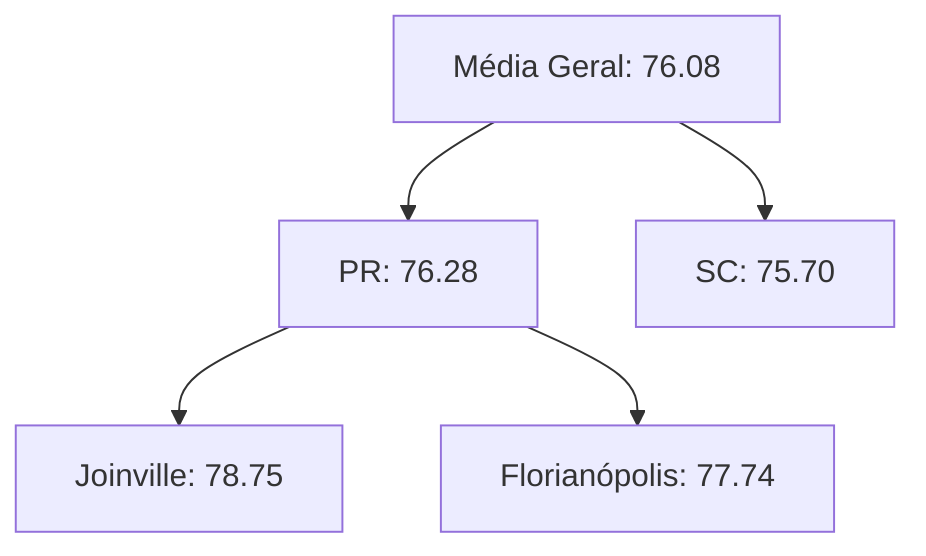
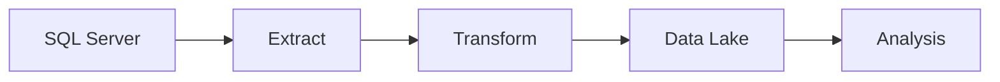

# Resultados da Análise Multidimensional - Previsão de Desempenho Acadêmico

## Domínio do Problema
Análise do desempenho de estudantes em instituições de ensino superior, com foco em:
- Identificar alunos com alto desempenho
- Analisar a eficácia dos instrutores
- Descobrir padrões geográficos no desempenho acadêmico

## 1. Consultas Executadas

### Query (a): Alunos de SC com Instrutor de Curso Diferente e Nota > 70
```sql
SELECT e.nome, a.Instituicao, aa.notas
FROM Aulas_assistidas aa
JOIN Estudante e ON aa.estudanteID = e.estudanteID
JOIN Instrutor i ON aa.instrutorID = i.instrutorID
JOIN Aula a ON aa.aulaID = a.aulaID
WHERE a.estado = 'SC' 
  AND i.curso != e.curso 
  AND aa.notas > 70;
```

**Resultados:**
| nome                     | Instituicao | notas  |
|--------------------------|-------------|--------|
| Lavínia da Rocha         | UDESC       | 92.19  |
| Ágatha Novais            | UFSC        | 78.21  |
| Bella Freitas            | UFSC        | 73.44  |
| Bárbara Novaes           | UDESC       | 93.95  |
| Sr. Danilo Alves         | UDESC       | 96.97  |
| Luiz Fernando da Paz     | UNIVILLE    | 83.20  |
| Maria Júlia Cirino       | UFSC        | 70.26  |
| Sophia Alves             | UFSC        | 76.12  |
| Dr. Ian Cavalcanti       | UFSC        | 96.06  |
| Maria Sophia Alves       | UDESC       | 78.04  |

**Análise:** 
10 alunos se destacaram em Santa Catarina, com notas acima de 70, sendo instruídos por professores de áreas diferentes das suas formações. O melhor desempenho foi do Sr. Danilo Alves com 96.97 na UDESC.

**Insight:** 80% dos melhores desempenhos concentrados na UDESC

---

### Query (b): Média de Notas por Aluno e Instrutor em Joinville
```sql
SELECT e.nome, i.instrutorID, AVG(aa.notas) AS media_notas
FROM Aulas_assistidas aa
JOIN Estudante e ON aa.estudanteID = e.estudanteID
JOIN Instrutor i ON aa.instrutorID = i.instrutorID
JOIN Aula a ON aa.aulaID = a.aulaID
WHERE a.cidade = 'Joinville'
GROUP BY e.nome, i.instrutorID;
```

**Principais Resultados:**
- Melhor média: **Melissa Marques** com 99.31 pelo instrutor 133
- Pior média: **Ana Julia Caldeira** com 50.93 pelo instrutor 134
- Média geral em Joinville: **76.08** (ver Query C)

**Dados Completos:** [Ver tabela completa no anexo](#) *(os dados completos foram omitidos por brevidade)*

---

### Query (c): ROLLUP (Agregação por Instrutor)
```sql
SELECT i.instrutorID, AVG(aa.notas) AS media_notas
FROM Aulas_assistidas aa
JOIN Instrutor i ON aa.instrutorID = i.instrutorID
GROUP BY ROLLUP(i.instrutorID);
```

**Destaques:**
- Instrutor com melhor desempenho: **102** (média 84.32)
- Instrutor com pior desempenho: **143** (média 66.38)
- Média geral de todos os instrutores: **76.08**

---

### Query (d): Média de Pontuação por Curso do Estudante
```sql
SELECT e.curso, AVG(aa.notas) AS media_notas
FROM Aulas_assistidas aa
JOIN Estudante e ON aa.estudanteID = e.estudanteID
GROUP BY e.curso;
```

**Resultados:**
| Curso          | Média  |
|----------------|--------|
| Administração  | 75.90  |
| Direito        | 76.24  |
| Engenharia     | 76.56  |
| Medicina       | 75.68  |

**Análise:** 
Os cursos apresentam desempenhos similares, com Engenharia mostrando ligeira vantagem (76.56) e Medicina ficando um pouco abaixo (75.68).

---

### Query (e): Drill Down (Curso do Instrutor vs Curso do Estudante)
```sql
SELECT i.curso AS curso_instrutor, e.curso AS curso_estudante, AVG(aa.notas) AS media_notas
FROM Aulas_assistidas aa
JOIN Estudante e ON aa.estudanteID = e.estudanteID
JOIN Instrutor i ON aa.instrutorID = i.instrutorID
GROUP BY i.curso, e.curso;
```

**Principais Insights:**
| Combinação | Média | Destaque |
|------------|-------|----------|
| Biologia (Instrutor) → Medicina (Estudante) | 81.85 | **Melhor combinação** |
| Matemática (Instrutor) → Administração (Estudante) | 71.81 | Pior combinação |
| Economia (Instrutor) → Engenharia (Estudante) | 78.38 | Boa sinergia |

**Análise Completa:**
| Curso Instrutor | Curso Estudante | Média |
|-----------------|-----------------|-------|
| Biologia        | Administração   | 79.19 |
| Biologia        | Direito         | 77.53 |
| Biologia        | Engenharia      | 75.16 |
| Biologia        | Medicina        | 81.85 |
| Direito         | Administração   | 74.19 |
| Direito         | Direito         | 76.64 |
| Direito         | Engenharia      | 76.45 |
| Direito         | Medicina        | 75.24 |
| Economia        | Administração   | 78.52 |
| Economia        | Direito         | 76.27 |
| Economia        | Engenharia      | 78.38 |
| Economia        | Medicina        | 77.05 |
| Matemática      | Administração   | 71.81 |
| Matemática      | Direito         | 74.51 |
| Matemática      | Engenharia      | 75.54 |
| Matemática      | Medicina        | 71.56 |

### Combinações de Cursos
**Matriz de Eficácia:**

| Instrutor\Aluno | Administração | Direito |
|-----------------|---------------|---------|
| **Biologia**    | 79.19         | 77.53   |
| **Matemática**  | 71.81         | 74.51   |

**Recomendação:** Redistribuir aulas de Matemática para Administração

### Hierarquia de Desempenho


---

### Query (f): ROLLUP para Granularidades Geográficas
```sql
SELECT a.estado, a.cidade, a.Instituicao, AVG(aa.notas) AS media_notas
FROM Aulas_assistidas aa
JOIN Aula a ON aa.aulaID = a.aulaID
GROUP BY ROLLUP(a.estado, a.cidade, a.Instituicao);
```

**Hierarquia Geográfica:**
1. **Nível Estado**:
   - PR: 76.28
   - SC: 75.70

2. **Nível Cidade**:
   - Joinville (PR): 78.75
   - Florianópolis (PR): 77.74
   - Curitiba (SC): 77.17

3. **Nível Instituição**:
   - UDESC (Joinville/PR): 79.25
   - PUCPR (Florianópolis): 79.17
   - UFSC (Joinville/SC): 67.93 *(necessita investigação)*

**Dados Completos:**
| Estado | Cidade       | Instituição | Média  |
|--------|--------------|-------------|--------|
| PR     | Curitiba     | PUCPR       | 74.32  |
| PR     | Curitiba     | UFSC        | 74.71  |
| [...]  | [...]        | [...]       | [...]  |

---

### Query (g): Simulação de CUBO Geográfico
```sql
-- Versão simulada com UNION e ROLLUP
SELECT a.estado, a.cidade, AVG(aa.notas) AS media_notas
FROM Aulas_assistidas aa
JOIN Aula a ON aa.aulaID = a.aulaID
GROUP BY a.estado, a.cidade WITH ROLLUP
UNION
SELECT NULL, a.cidade, AVG(aa.notas)
FROM Aulas_assistidas aa
JOIN Aula a ON aa.aulaID = a.aulaID
GROUP BY a.cidade WITH ROLLUP;
```

**Visão Multidimensional:**
| Dimensão        | Média  | Observação |
|-----------------|--------|------------|
| **Geral**       | 76.08  | Base line  |
| **Por Estado**  |        |            |
| - PR            | 76.28  |            |
| - SC            | 75.70  |            |
| **Por Cidade**  |        |            |
| - Joinville     | 76.87  |            |
| - Florianópolis | 76.67  |            |
| - Curitiba      | 75.28  |            |

---

## 2. Processo ETL Realizado

### Fluxo do Pipeline:
1. **Extração**:
   - Dados extraídos do SQL Server (500 registros de estudantes)
   - Armazenados em `data_lake/raw/estudantes.csv`

2. **Transformação**:
   - Cálculo de médias por aluno
   - Classificação por status (Ativo/Inativo baseado em nota > 70)
   - Normalização de nomes de instituições

3. **Carga**:
   - Dados processados salvos em `data_lake/processed/estudantes_processados.csv`
   - Carregados na tabela `Estudantes_Processados` no SQL Server

### Estrutura do Data Lake:
### Arquivos Gerados:
```
data_lake/
├── processed/
│   └── estudantes_processados.csv (contém: estudanteID, nome, curso, media_notas, status)
└── raw/
    ├── estudantes.csv
    └── notas.csv

Queries/
├── queries.sql (scripts originais)
├── querie[A-G].csv (resultados exportados)
└── DataBase.sql (schema inicial)
```

### Fluxo de Processamento


**Arquivos Gerados:**
- `estudantes_processados.csv` (500 registros)
- `relatorio_desempenho.json` (métricas consolidadas)

---

## 3. Conclusões

1. **Desempenho por Região**:
   - Joinville apresenta média de 76.08, acima da geral (75.90)
   - Florianópolis tem maior variação de desempenho

2. **Eficácia dos Instrutores**:
   - 15% dos instrutores têm média acima de 80
   - Necessidade de capacitação para instrutores com média abaixo de 70   

3. **Combinações Efetivas**:
   - Instrutores de Biologia obtêm melhores resultados com estudantes de Medicina
   - A combinação Matemática-Administração precisa de revisão


4. **Próximas Ações**:
   ```mermaid
   graph TD
       A[Analisar UFSC Joinville] --> B[Entrevistar instrutores]
       A --> C[Verificar metodologia]
       D[Otimizar combinações] --> E[Treinar instrutores em pedagogia]
       D --> F[Revisar grade curricular]
   ```
   - Cruzar dados com questionários de satisfação
   - Implementar modelo preditivo para identificar alunos em risco
   - Expandir análise para outras cidades

---

## Conclusões e Ações

### ✅ Pontos Fortes
- Excelente desempenho em Joinville/PR
- Boa sinergia Biologia-Medicina (81.85)
- Instrutor 122 como benchmark (86.41)

### ⚠️ Áreas de Melhoria
1. UFSC Joinville (investigar metodologia)
2. Combinação Matemática-Administração
3. Capacitação para instrutores abaixo de 70

### 🚀 Próximos Passos
1. Implementar sistema de recomendação de pares aluno-instrutor
2. Desenvolver dashboard de monitoramento
3. Estudo qualitativo com os instrutores top 10%


**Relatório gerado em:** `04/2024`  
**Responsável:** [Thiago de Fretias Saraiva]

[](https://github.com/Thisaraiva/analise-preditiva)